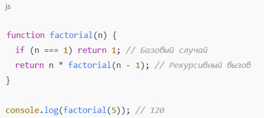

# Recursion

## Что такое рекурсия?
#### Рекурсия — это когда функция вызывает саму себя.

#### Но важно, чтобы в коде было условие выхода — момент, когда вызовы заканчиваются. Без него программа зациклится и вызовет ошибку.

#### Это похоже на русские матрёшки: ты открываешь одну, внутри другая, потом ещё одна... Пока не дойдёшь до самой маленькой — и тогда начинаешь складывать их обратно.
## Два главных элемента рекурсии
#### Базовый случай – это условие, при котором функция больше не вызывает себя.
#### Рекурсивный случай – это когда функция вызывает себя с новыми параметрами.
### Пример: факториал числа
##### Факториал — это произведение всех чисел от 1 до n:
### 5! = 5 × 4 × 3 × 2 × 1 = 120
##### С рекурсией:

##### Работает так:

### factorial(5) = 5 * factorial(4)
### factorial(4) = 4 * factorial(3)
### factorial(3) = 3 * factorial(2)
### factorial(2) = 2 * factorial(1)
### factorial(1) = 1 (здесь функция останавливается)
### Затем все вызовы начинают сворачиваться обратно и перемножаются.
